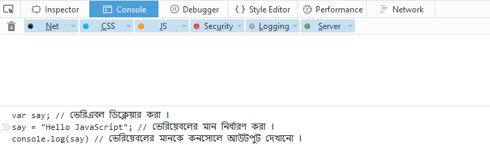

#জাভাস্ক্রিপ্টের সিনট্যাক্স।

প্রত্যেকটি প্রোগ্রামিং ল্যাংগুয়েজের একটি নিদ্রিষ্ট নিয়ম থাকে এবং এইসব নিয়ম খেয়াল করে ওই প্রোগ্রামিং ল্যাঙ্গুয়েজের প্রোগ্রাম লিখা হয়। জাভাস্ক্রিপ্ট এর সিনট্যাক্স বলতে জাভাস্ক্রিপ্ট প্রোগ্রাম লিখার নিয়ম কে বোঝানো হয়।

আমরা এই অধ্যায়ে জাভাস্ক্রিপ্ট প্রোগ্রাম লিখার কিছু বেসিক সিনট্যাক্স দেখবো একটি ছোট জাভাস্ক্রিপ্ট প্রোগ্রাম লিখার মাদ্ধমে। আমরা যেহেতু জাভাস্ক্রিপ্ট নিয়ে কেবল মাত্র শুরু করছি তাই আমরা অনেক কিছু না বুঝে থাকতে পারি বা অনেক কিছু নতুন মনে হতে পারে কিন্তু ঘাবড়ানোর কোনো কারণ নেই আমরা এই সব কিছু নিয়ে পরে আলোচনা করবো এবং আস্তে আস্তে বুঝার চেষ্টা করবো।

##হ্যালো জাভাস্ক্রিপ্ট প্রোগ্রাম।

```
var say; // ভেরিএবল ডিক্লেয়ার করা ।
say = "Hello JavaScript"; // ভেরিয়েবলের মান নির্ধারণ করা ।
console.log(say) // ভেরিয়েবলের মানকে কনসোলে আউটপুট দেখানো ।
```
আচ্ছা আসুন আমরা এই ছোট্ট প্রোগ্রামটি রান করে দেখি।
এই প্রোগ্রামটি রান করার জন্য আপনি আপনার কম্পিউটার থেকে মজিলা বা ক্রোম ব্রাউসার ওপেন করে রাইট মাউস ক্লিক করে ইন্সপেক্ট এলিমেন্ট এ ক্লিক করার পর কনসোল অপসন এ ক্লিক করুন এবং নিচের চিত্রের মতো একটি উইন্ডো ওপেন হবে।

